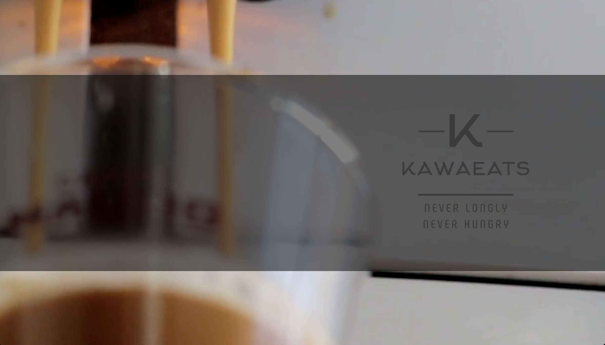

# KawaEats
A web application for foodies

## Skills
Front end: HTML, CSS, Javascript, Bootstrap  
Backend: Java, MySQL  
IDE: Eclipse  

## Highlights
Used Google map API to access user's locations  
Preimum functions for login-in user  
Implemented web sockets for real time chat  

## User Interface

Cover Page

Sign up page for user

Premium Homepage after logged in

User Profile page
